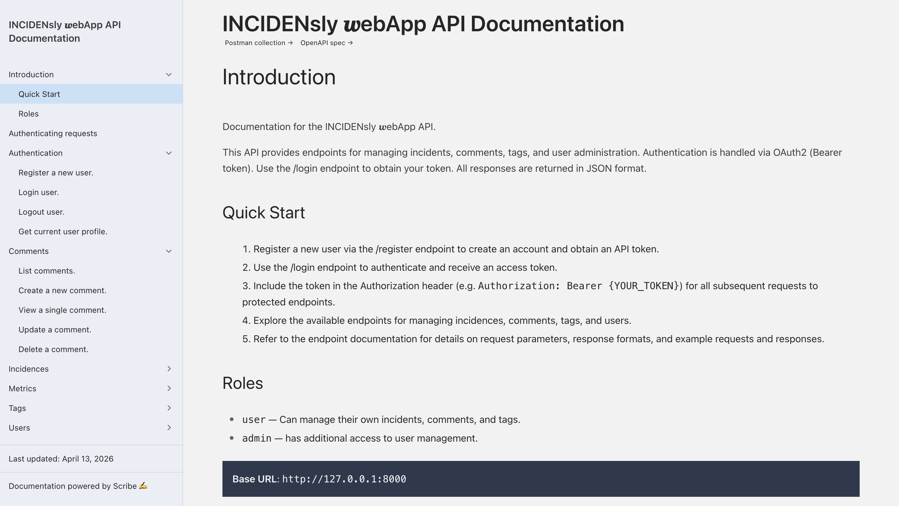
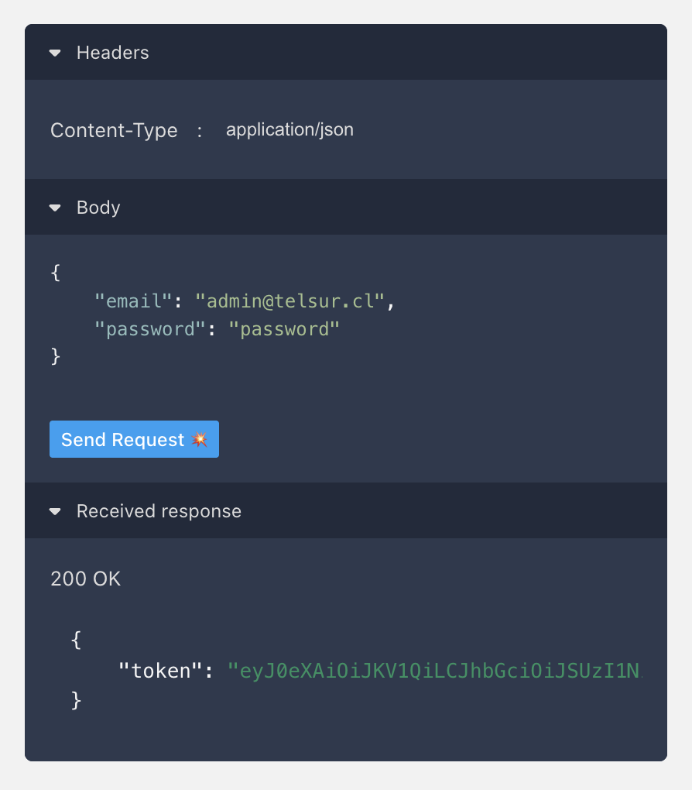

<p align="center">
  
</p>

Incident manager system with a complete REST API and automated tests. Built with Laravel 12 and OAuth2 authentication via Passport.

---

## Table of Contents

- [Features](#features)
- [Requirements](#requirements)
- [Local Installation](#local-installation)
- [Configuration](#configuration)
- [Running Tests](#running-tests)
- [Static Analysis](#static-analysis-phpstan)
- [API Usage](#api-usage)
- [Data Model](#data-model)
- [Security & Authorization](#security--authorization)
- [Code Style](#code-style)
- [Known Issues & Bugs](#known-issues--bugs)
- [Future Improvements](#future-improvements)

---

## Features

### App 
- **RESTful API** — Versioned endpoints (v1) following REST practices
- **OAuth2 Authentication** — Access tokens via Laravel Passport
- **Incident Management** — Full CRUD with filters, full-text search, and pagination
- **Nested Comments** — Threaded comment system with hierarchical replies (parent_id)
- **Tag System** — Flexible tagging with N:M relationship between incidences
- **Aggregated Metrics** — Statistics by status and priority (admin only)
- **User Management** — Complete admin dashboard

### Docs
- **Interactive Documentation** — Auto-generated API docs with Scribe + OpenAPI 3.0


---

## Requirements

| Requirement | Minimum Version | Notes |
|-------------|----------------|-------|
| PHP | 8.2+ | Requires extensions: pdo, mbstring, xml, json |
| Composer | 2.x | PHP dependency manager |
| Node.js | 18.x | Optional, only for asset compilation |
| NPM | 9.x | Optional |
| SQLite | 3.x | Default; also supports MySQL 8+ and PostgreSQL 13+ |
| Docker | 20.x | For containerized installation |

---

## Local Installation

### 1. Clone the repo
```
git clone https://github.com/malmental/S5_API_REST.git
cd S5_API_REST
```

### 2. Create the SQLite database file (must be done before any migration)
```
touch database/database.sqlite
```

### 3. Copy and configure `.env`
```
cp .env.example .env
```

### 4. Install PHP dependencies
```
composer install
```

### 5. Generate app key
```
php artisan key:generate
```

### 6. Run migrations 
(this creates all tables, including the custom OAuth tables — not Passport's default ones)
```
php artisan migrate:fresh
```

### 7. Generate Passport encryption keys 
(creates oauth-public.key and oauth-private.key in storage/)
```
php artisan passport:keys --force
```

### 8. Generate Passport OAuth clients 
(creates the password grant and personal access clients in the oauth_clients table)
```
php artisan passport:client --password
```
### 9. Seed the database
```
php artisan db:seed
```

### 10. Build assets (optional)
```
npm install && npm run build
```
### 11. Start the server
```
php artisan serve
```

The API will be available at `http://localhost:8000`

---

## Configuration

### Environment Variables

| Variable | Description | Default |
|----------|-------------|---------|
| `APP_ENV` | Environment (local, production) | `local` |
| `APP_DEBUG` | Debug mode | `true` |
| `APP_URL` | Application base URL | `http://localhost` |
| `DB_CONNECTION` | Driver: sqlite, mysql, pgsql | `sqlite` |
| `CACHE_STORE` | Cache driver | `database` |
| `QUEUE_CONNECTION` | Queue driver | `database` |
| `SESSION_DRIVER` | Session driver | `database` |

---

## Running Tests

```bash
# Run full suite
php artisan test

# Specific feature tests
php artisan test --filter=IncidenceTest
php artisan test --filter=UserTest
php artisan test --filter=AuthTest
php artisan test --filter=CommentTest
php artisan test --filter=TagTest
```

### Run a specific test

You can run an specific test method by reading the name on the file and running command. 

Here's a little help:

```bash
php artisan test --filter=test_authenticated_user_can_create_incidence
```

---

## API Usage

<h3>
  <a href="https://incidensly-webapp-production.up.railway.app/docs/" target="_blank">
    ➪ You can try me right on !
  </a>
</h3>

<p align="center">
  
</p>

Or ... you can complete your request in your local environment remembering the following initial credentials:
````
Admin user: admin@telsur.cl
Password: password

Regular user: noadmin@telsur.cl
Password: password
````

### Interactive Documentation

Access the complete API documentation at:

```
http://localhost:8000/docs
```

Includes:
- Complete endpoint reference
- Try It Out (test endpoints directly from browser)
- Request/response examples

As you had run the seeder, you have a full database with sample data to test the endpoints. 

### Postman Collection

Import the ready-to-use Postman collection:

```
docs/INCIDENsly_API.postman_collection.json
```

It includes all endpoints with pre-configured requests and sample data.

### Authentication Format

The API uses Bearer Token authentication via Laravel Passport.

```http
Authorization: Bearer {token}
Content-Type: application/json
```

### Example: Login

<p align="center">
  
</p>

And with this information you can test all the endpoints that require authentication, just remember to replace `{token}` with the actual token you receive from the login response.

For non admin users, you can use the regular user credentials to test endpoints that require authentication but not admin privileges.

Down below you can find some examples of how to use the API with filters, pagination and full-text search. I will leave this here as a reference for you to test the API and see how it works with different parameters from the business logic perspective.

##### NOTE:

Add | json_pp at the end of the curl command to pretty print the JSON response in the terminal.

```bash
curl "http://localhost:8000/api/v1/incidences?status=open" | json_pp
``` 

### Example: List Incidences with Filters

```bash
# Filter by status
curl "http://localhost:8000/api/v1/incidences?status=open" 

# Filter by priority
curl "http://localhost:8000/api/v1/incidences?priority=high"

# Full-text search
curl "http://localhost:8000/api/v1/incidences?search=server"

# Combined filters
curl "http://localhost:8000/api/v1/incidences?status=open&priority=high&search=server"

# Filter by tags
curl "http://localhost:8000/api/v1/incidences?tags=1,2,3"

# Pagination
curl "http://localhost:8000/api/v1/incidences?per_page=20&page=2"
```

---

## Data Model

```
┌─────────────┐         ┌──────────────┐         ┌─────────────┐
│    User     │         │  Incidence   │         │     Tag     │
├─────────────┤         ├──────────────┤         ├─────────────┤
│ id          │◄─┐      │ id           │      ┌──│ id          │
│ name        │  │      │ title        │      │  │ name        │
│ email       │  └──────│ user_id (FK) │      │  │ user_id(FK) │
│ is_admin    │         │ assigned_to  │◄─────┘  └─────────────┘
│ password    │         │ status       │                │
└─────────────┘         │ priority     │               N:M
                        └──────────────┘          incidence_tag
                               │ 1:N              (pivot table)
                               ▼                        │
                        ┌──────────────┐                │
                        │   Comment    │◄───────────────┘
                        ├──────────────┤
                        │ id           │
                        │ body         │
                        │ user_id (FK) │
                        │ incidence_id │
                        │ parent_id    │──►(self-reference)
                        └──────────────┘
```

### Eloquent Relationships

- **User → Incidences**: `hasMany` (created by user)
- **User → assignedIncidences**: `hasMany` (assigned to user)
- **Incidence → user**: `belongsTo` (creator)
- **Incidence → assignedUser**: `belongsTo` (assignee)
- **Incidence → tags**: `belongsToMany`
- **Incidence → comments**: `hasMany`
- **Comment → user**: `belongsTo`
- **Comment → incidence**: `belongsTo`
- **Comment → parent/children**: `belongsTo`/`hasMany` (self-referencing)

---

## Security & Authorization

### Middleware

- `auth:api` — Requires valid Passport token
- `is_admin` — Verifies `user.is_admin = true`

### `AuthorizesUser` Trait

```php
// Authorize owner OR admin
if ($response = $this->authorizeOwnerOrAdmin($incidence)) {
    return $response;
}

// Authorize owner only
if ($response = $this->authorizeOwner($comment)) {
    return $response;
}
```

---

## Known Issues & Bugs

### Bugs to Fix

- **IncidencePolicy not used**: A policy exists at `app/Policies/IncidencePolicy.php` but controllers use the `AuthorizesUser` trait instead. The policy is never registered or used, creating unnecessary duplication.

- **N+1 query in syncTags()**: When creating/updating incidences with multiple tags, the `syncTags()` method in `IncidenceController` performs one query per tag (up to 10). Should be optimized to batch queries.

- **Missing database indexes**: The `incidences` table has no indexes on frequently filtered columns (`status`, `priority`, `created_at`). This will cause performance issues at big scale.

### Configuration Issues (Fixed)

- **Duplicate Passport migrations**: Multiple sets of Passport migrations existed (timestamp `2026_04_13_*`). Removed duplicate sets. Ensure only one set exists in `database/migrations/`.

- **SQLite path in .env.example**: Previously set to `/absolute/path/to/database.sqlite`. Updated to relative path `database/database.sqlite`.

---

## Future Improvements

- [ ] Add database indexes on `incidences.status`, `incidences.priority`, `incidences.created_at` (this would be very significant for performance if the dataset grows fat)
- [ ] Optimize `syncTags()` to batch tag lookups instead of one query per tag
- [ ] Implement soft deletes for incidences and comments (data recovery)
- [ ] Add comprehensive caching layer for metrics endpoint
- [ ] Add rate limiting to API endpoints (`throttle` middleware)
- [ ] Add role-based access control with multiple roles instead of boolean `is_admin` -> This is a big change but it would be nice to have more granular roles and permissions in the future (RBAC)

### It would be nice to have:

- [ ] Add email/Slack notifications on incidence status changes
- [ ] Add image/file attachments for incidences
- [ ] Audit log for incidence changes
- [ ] Implement draft/archived incidence states

---
